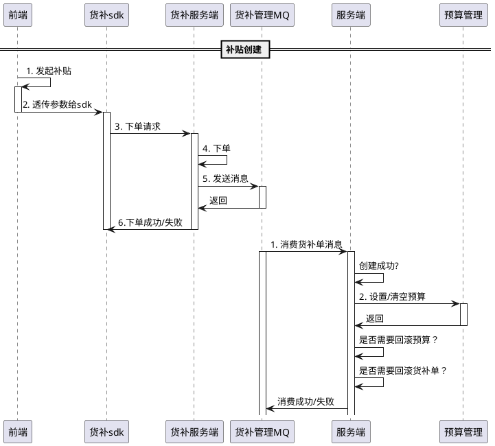
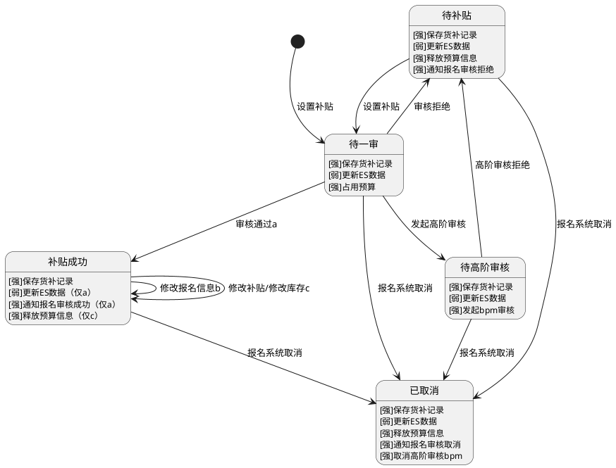
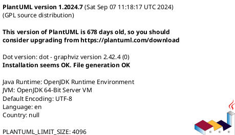

时序图

```plantuml
scale 1.2
skinparam defaultFontName "'Microsoft YaHei','Source Han Sans','JetBrains Mono',Consolas,Monaco"
skinparam defaultFontName 微软雅黑

@startuml

participant "前端" as A
participant "货补sdk" as B
participant "货补服务端" as C
participant "货补管理MQ" as D
participant "服务端" as E
participant "预算管理" as F

== 补贴创建 ==
A -> A: 1. 发起补贴 
activate A
A -> B: 2. 透传参数给sdk
deactivate A
activate B
B -> C: 3. 下单请求
activate C
C -> C: 4. 下单
C -> D: 5. 发送消息
activate D
D -> C: 返回
deactivate D
C -> B: 6.下单成功/失败
deactivate C
deactivate B


D -> E: 1. 消费货补单消息
activate D
activate E
E -> E: 创建成功?
E -> F: 2. 设置/清空预算
activate F
F -> E: 返回
deactivate F
E -> E: 是否需要回滚预算？
E -> E: 是否需要回滚货补单？
E -> D: 消费成功/失败
@enduml
```

状态机
!theme sandstone

```plantuml
!theme sandstone
scale 1.2
skinparam defaultFontName YaHei

@startuml

待补贴 --> 待一审 : 设置补贴

[*] --> 待一审 : 设置补贴
待一审 : [强]保存货补记录
待一审 : [弱]更新ES数据
待一审 : [强]占用预算


待一审 --> 补贴成功 : 审核通过a
补贴成功 : [强]保存货补记录
补贴成功 : [弱]更新ES数据（仅a）
补贴成功 : [强]通知报名审核成功（仅a）

待一审 --> 待高阶审核: 发起高阶审核
待高阶审核 : [强]保存货补记录
待高阶审核 : [弱]更新ES数据
待高阶审核 : [强]发起bpm审核


待高阶审核 --> 待补贴: 高阶审核拒绝
待一审 --> 待补贴: 审核拒绝
待补贴 : [强]保存货补记录
待补贴 : [弱]更新ES数据
待补贴 : [强]释放预算信息
待补贴 : [强]通知报名审核拒绝

待一审 --> 已取消: 报名系统取消
待补贴 --> 已取消: 报名系统取消
待高阶审核 --> 已取消: 报名系统取消
补贴成功 --> 已取消: 报名系统取消
已取消 : [强]保存货补记录
已取消 : [弱]更新ES数据
已取消 : [强]释放预算信息
已取消 : [强]通知报名审核取消
已取消 : [强]取消高阶审核bpm


补贴成功 --> 补贴成功: 修改报名信息b
补贴成功 --> 补贴成功: 修改补贴/修改库存c
补贴成功 : [强]释放预算信息（仅c）

@enduml
```

```plantuml
@startuml
version
@enduml
```