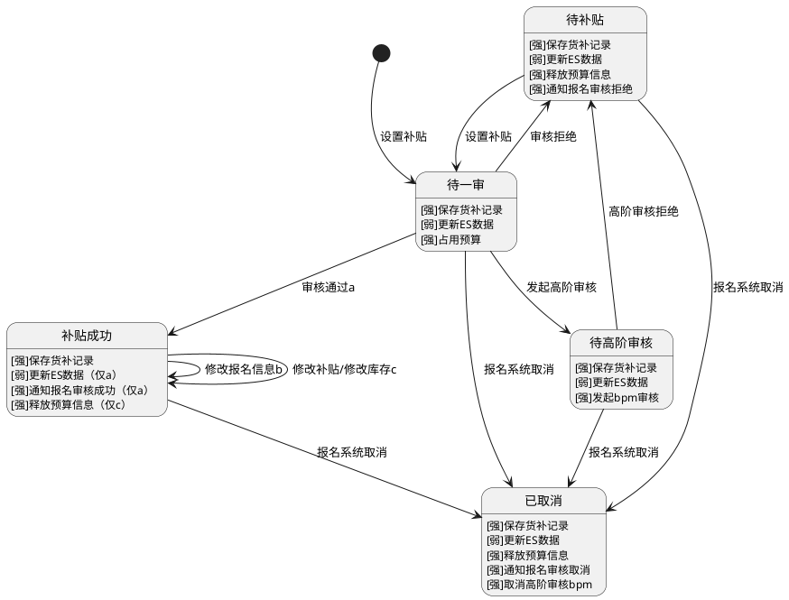

# 

时序图

状态机

```plantuml
@startuml

待补贴 --> 待一审 : 设置补贴

[*] --> 待一审 : 设置补贴
待一审 : [强]保存货补记录
待一审 : [弱]更新ES数据
待一审 : [强]占用预算


待一审 --> 补贴成功 : 审核通过a
补贴成功 : [强]保存货补记录
补贴成功 : [弱]更新ES数据（仅a）
补贴成功 : [强]通知报名审核成功（仅a）

待一审 --> 待高阶审核: 发起高阶审核
待高阶审核 : [强]保存货补记录
待高阶审核 : [弱]更新ES数据
待高阶审核 : [强]发起bpm审核


待高阶审核 --> 待补贴: 高阶审核拒绝
待一审 --> 待补贴: 审核拒绝
待补贴 : [强]保存货补记录
待补贴 : [弱]更新ES数据
待补贴 : [强]释放预算信息
待补贴 : [强]通知报名审核拒绝

待一审 --> 已取消: 报名系统取消
待补贴 --> 已取消: 报名系统取消
待高阶审核 --> 已取消: 报名系统取消
补贴成功 --> 已取消: 报名系统取消
已取消 : [强]保存货补记录
已取消 : [弱]更新ES数据
已取消 : [强]释放预算信息
已取消 : [强]通知报名审核取消
已取消 : [强]取消高阶审核bpm


补贴成功 --> 补贴成功: 修改报名信息b
补贴成功 --> 补贴成功: 修改补贴/修改库存c
补贴成功 : [强]释放预算信息（仅c）

@enduml
```

